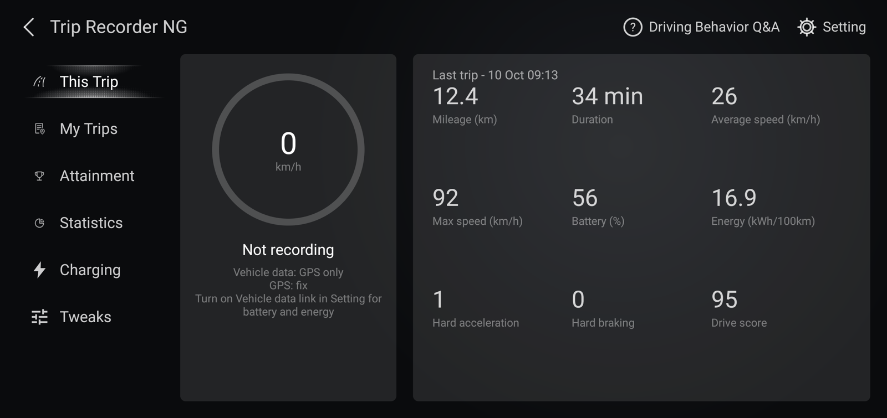
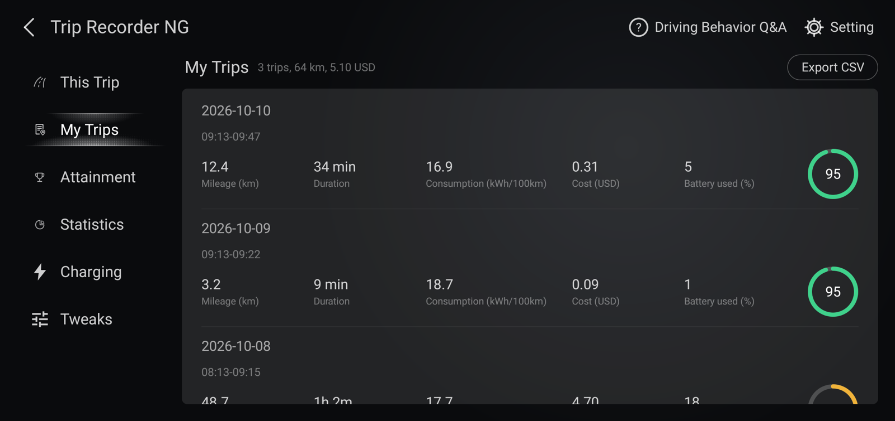
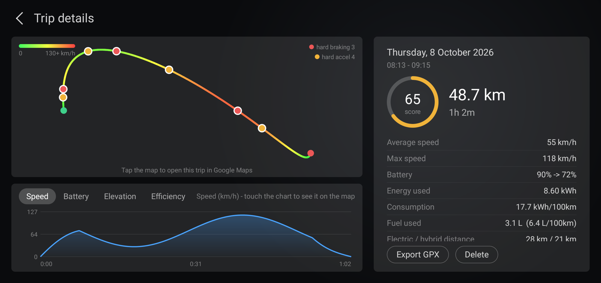
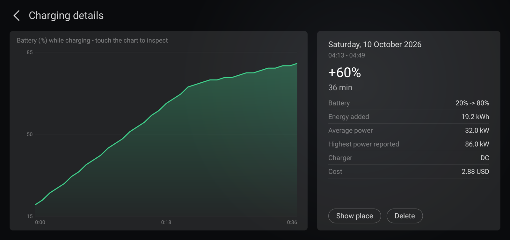
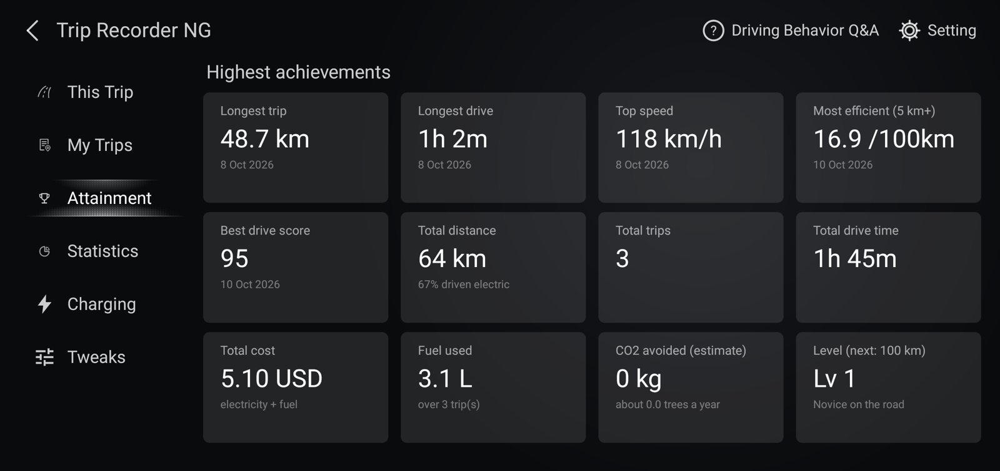
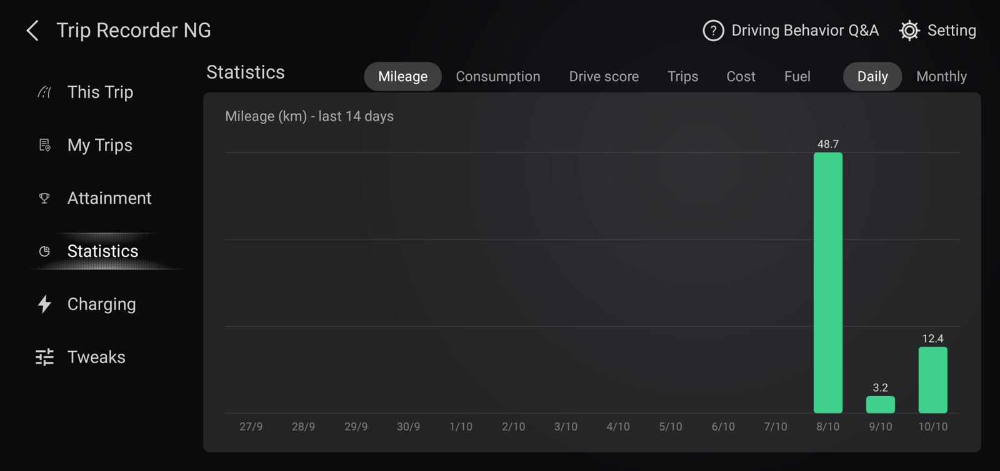
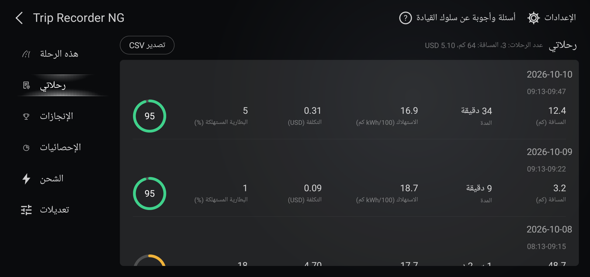
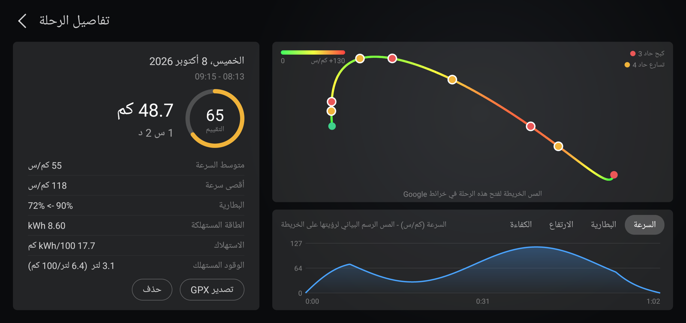

# Trip Recorder NG

An unofficial trip recorder for BYD cars with a DiLink head unit. It records every drive on the head unit
itself (route, speed, battery and energy use, fuel, charging sessions, cost) and shows it in screens modelled
on BYD's stock "Driving behavior" app: This Trip, My Trips, Attainment, Statistics, Charging and Tweaks, plus
Q&A and Setting pages. Everything stays on the car, nothing is uploaded. The app is in English and Arabic
(with a right-to-left layout for Arabic).

Package `org.triprecorderng`. Built and tested on one plug-in hybrid with DiLink 5.1 (Android 13). Other BYD
models and software versions may behave differently; reports and fixes are welcome.

> **Not affiliated with BYD.** "BYD" and "DiLink" belong to their owners and are used here only to say what
> the app works with. Read the [Disclaimer](#disclaimer) before installing.

## Why this exists
BYD's own trip recorder, part of the My Car app ("Driving behavior"), depends on a BYD server. BYD has applied
geo-restrictions to that server, so in the affected regions the recorder no longer works.

Trip Recorder NG fills that gap. It records the same kind of data directly on the head unit, keeps everything on
the car, and needs neither a BYD server nor a BYD account, so a geo-restriction cannot switch it off.

## Screenshots
The head unit's screen, showing the app's built-in sample trips and charging sessions (not real trips).

| | |
|---|---|
|  |  |
|  |  |
|  |  |
|  |  |

The Arabic screens are mirrored right to left in the content area, with the menu kept on the left.

## Quick start
1. Build the APK with `./build.sh` (see [Build](#build)).
2. Install it on the head unit over ADB: `adb install -r TripRecorderNG.apk` (you need ADB access to the head
   unit; how to enable it depends on the model and software version).
3. Open the app and allow location.
4. In the car's Setting > BYD auto-start apps ("Disable background Apps"), turn **Trip Recorder NG OFF**
   (OFF = allowed to start), then restart the head unit once. Without this BYD blocks the app from starting
   by itself. This switch is reset by **every** install or update (see [Install / update](#install--update)).
5. Optional but recommended: Setting > Vehicle data link > Enable, to get battery, energy, odometer, fuel and
   charging data (see [Vehicle data link](#vehicle-data-link-optional-off-by-default)).

## Disclaimer
- This is an unofficial hobby project, provided as is with no warranty (see [LICENSE](LICENSE)). You install
  and use it at your own risk. It is not endorsed or supported by BYD.
- It reads vehicle data through BYD's internal, undocumented vehicle API. Any software update of the car can
  change or break that. The only things the app changes on the car are Android's data-roaming switch, when you press the
  button or turn on the toggle in the Tweaks tab, and the app itself, when you choose Install after Check for
  updates (it replaces itself with a build downloaded from this project's GitHub releases, signed with the same key).
- The optional **Vehicle data link** starts a small helper through the head unit's own debugging service on
  127.0.0.1 (loopback ADB), with a key the app creates itself. On the tested unit the car accepted that key
  without asking, which means any app on that unit could do the same; this is a property of the car, not of
  this app. Leave the link off if you are not comfortable with that. **Disable** stops the helper and
  **Forget** deletes the key.
- Do not operate the screen while driving. The app records by itself and needs no attention on the road.

## Privacy
Trips are stored in the app's own database on the head unit. Backups and exports (JSON, CSV, GPX) are written
to `Documents/TripRecorderNG`, a shared folder that any app with storage permission can read. They contain GPS
tracks, so they show where you live and drive: delete or do not share them if that matters to you. The app asks
for the INTERNET permission for loopback connections to the helper and the car's debugging service, and for
**Setting > Check for updates**. The app never goes online by itself and uploads nothing. It contacts GitHub
(`api.github.com`, and `github.com` to download a build) only when you tap Check for updates or Install; GitHub then
sees the car's IP address and the app's build name. The Google Maps link in trip details hands a route to the Maps
app or browser when you tap it.

## What it does
- A foreground service starts at boot and records trips locally (SQLite). Nothing is uploaded.
- Data source, chosen automatically (see `VehicleProvider`):
  1. BYD's vehicle API called directly,  2. the `autoservice` binder called directly,
  3. the shell-user helper (only when Setting > Vehicle data link is on, see below),
  4. **GPS only** (the fallback; trips are then detected by movement).
  The car refuses 1 and 2 to a normal app (`SecurityException: permission deny`): the readings need
  BYD's signature-level `BYDAUTO_*_GET` permissions, which only system apps can hold.
- GPS-only mode records: speed, distance, duration, route (GPS track), max/avg speed, hard
  acceleration/braking and a simple drive score. A trip starts after 3 s above 5 km/h and ends after
  3 min standing still; trips under 50 m are discarded.
- Not available in GPS-only mode: ignition state, battery %, energy counter, odometer
  (those columns show "--").
- Export: CSV (all trips) and GPX (per trip) to Documents/TripRecorderNG.
- Trip details: tapping the track opens the trip in Google Maps (`MapLink`) as a driving route from the
  start to the end through up to 8 waypoints that keep the track's shape. Google Maps cannot draw an
  arbitrary polyline from a link, so it follows the roads between those points (the 186 km test trip
  showed 207 km in Maps). Needs internet on the car; falls back to the browser if the Maps app is missing.

## Backup and restore
Each finished trip and charging session is also written as a small JSON file (summary, track, events,
battery and energy samples) to `Documents/TripRecorderNG/backup`, so it survives an uninstall or a cleared
app. Setting has Automatic backup (on by default), Back up now and Restore from backup (adds what is
missing, never overwrites; deleting a trip or session in the app also deletes its backup file). My Trips
offers the restore button when it is empty and backup files exist. Source: `Backup`.

## Trip details
Route coloured by speed (green slow, red 130+ km/h), red/amber dots for hard braking/acceleration, and
under the map a chart of Speed, Battery, Elevation or Efficiency (kWh/100 km by speed band). Touching
a chart marks that moment on the map. Battery, Efficiency and the event dots need data recorded by
this version (older trips show speed and elevation). Source: `RouteView`, `TripChartView`,
`TripChartsPanel`, `TripAnalysis`.

## When a trip ends
A trip started by the ignition ends when the ignition reads off (5 s grace). If the ignition cannot be
read (the data-link helper is down and only GPS is left) the trip is held open instead of being closed
by the standing-still rule: it ends only if the ignition stayed unreadable for 10 minutes and the car has
stood still for 3 minutes, and its end time is then the last moment the ignition was on or the car moved.
It never ends by this rule while the car is moving, and 10 minutes without any speed data still ends it.
A trip started by movement (no ignition available) ends after 3 minutes standing still, as before. The
rules live in `TripEnd`; tested on the car by disabling the data link for 5 minutes
while parked: the trip stayed open and carried on when the link came back. Separately, an open trip is
resumed if the app restarts within 10 minutes (so a restart does not split a trip).

## Standing still
While the car is stopped a point (speed 0, battery, position) is still stored every 10 s (3 s while moving), so the
speed, battery and elevation charts have no hole at stops. With no GPS fix and the car stopped (garage) the last
known position is reused. For trips recorded before this change the speed chart draws a gap as a flat line when both
sides are at or below 5 km/h (a real data hole at speed still breaks the line), and the battery and elevation charts
join across gaps. Dragging a finger over a chart moves the cursor with the finger and shows values interpolated between
samples, including across a stretch with no samples; across a real data hole (line broken) it snaps to the nearest
sample. The efficiency chart ignores samples where the car was standing still. Source: `RecorderService`,
`TripAnalysis`, `TripChartView`.

## Trip distance
The distance of a trip is read from the car's own trip counter (the instrument cluster's journey
mileage, `BYDAutoInstrumentDevice.getCurrentJourneyDriveMileage`, 0.1 km steps, via the helper), added up
step by step so a restart of the counter is handled. It matched the odometer and the GPS path on the
checked trip (35.5 / 35 / 35.49 km). The recorder also integrates the speedometer value, which reads
about 4 % above the real speed (37.0 km for the same trip); that integral (`speed_km`) is only used
below 1 km, when no counter reading exists, and to estimate the part driven before the counter was first
read. A long trip refines the stored ratio (starts at 0.958). GPS is used for the route, not for distance.
Source: `JourneyTracker`. If two charging sessions follow each other at the same battery level with no trip
between them (up to 12 h apart) they are joined into one (`ChargeRecorder.repairSplits`).

## Charging
Needs the Vehicle data link: the helper reads `BYDAutoChargingDevice` (read-only getters). A session
starts when the battery-management state is "charging" (1, or 13 paused) with a cable connected and
ends a minute after that stops; the battery % is sampled along the way. On the tested unit the car
reports the state and cable type (AC/DC) but charging power and charged kWh read 0, so the energy
shown is an estimate: % gained x kWh per % learned from the trips (median of trips with at least 8 %
used; 0.32 kWh/% here). If a unit does report kWh, that value is used.
The head unit sleeps when the car is off and the app does not run while it sleeps. A session whose
start the app did not see, or with a gap of 2.5 min or more in the readings, is marked *Partial*; when
a session ends, the battery level at that moment becomes its final level (a lower reading, as when the
car is driven off, is ignored). Partial sessions show no average power.
If the unit slept through a whole charge (car off, plugged in, charged, then switched on), the app saves
the last battery level it saw (persisted) and compares it with the level at wake: a rise of 2 % or more
with a charge sign (cable connected or a charge state), or 5 % or more without one, is logged as a
"window only" session (levels before and after, times are the window, not the charge duration). A
smaller jump with no charge sign is treated as a battery recalibration and ignored. Source: `ChargeRecorder`,
`Charge`, helper protocol v2 (`chg`).

## Features taken from the stock Driving behavior app
This car is a plug-in hybrid: besides the battery, the car reports a fuel counter (litres), EV and
hybrid-mode distance counters, the fuel level and the remaining EV / fuel range. Each trip now records
the fuel and EV/HEV counters like it does the energy counter (helper protocol v3, DB v5), and This Trip
shows the live range. Trips from before this update have no fuel data.
- **Cost calculator** (Setting > Energy prices: electricity per kWh, fuel per litre, currency; the
  defaults are 0.010 OMR/kWh and 0.239 OMR/L, the author's local prices, used for any price you leave
  empty so a cost is always calculated: set your own currency and prices there). Trip
  cost = energy used x electricity price + fuel used x fuel price; shown on each trip, in the My Trips
  total, as a Cost chart in Statistics (daily/monthly) and in the CSV. Charging sessions get a cost from
  the energy added. Charging losses are not included. `Cost`, `Prefs`.
- **Trip details**: fuel used and L/100 km, electric/hybrid distance, idle time, time above 100 km/h
  and Driving advice (the stock app's advice texts, picked by simple rules). `Advice`.
- **Attainment**: total cost, fuel used, CO2 avoided (estimate against a petrol car at 8 L/100 km, minus
  fuel burned and 0.4 kg CO2 per kWh) and a driving level (stock level names, stepped by recorded km).
- **Record route** switch (stock "Historical track"): off = new trips keep no route or event positions.
- Not possible offline: the stock app's national/city rankings and place names (they come from BYD's
  server). Not done: scoring from seat belt, A/C, turn-signal and lane-change signals.

## Auto-start reminder
BYD's own switch ("Disable background Apps") cannot be read, so the app infers it: if the system's start
broadcast did not reach the app after the last restart, auto-start is blocked; right after an install or update it is
"not confirmed yet" (BYD resets the switch then). In either case a dialog explains how to turn the switch OFF and
offers **Open BYD settings**. It is shown **every time the app is opened**: a new start of the app, or coming back
after the screen was away for more than 3 seconds (a language change or a dialog is not a new opening, and the
reminder waits 10 minutes after you went to BYD's screen from it). It is not shown while the car is
moving, nor in the first 3 minutes after a boot (the start broadcast may not have arrived yet), and it stops by
itself once a restart has started the app.
- **Don't show again** mutes it, but the reminder still comes back on every 15th opening of the app while
  auto-start is blocked (openings are counted from the moment you muted; the reminder dialog then offers **Show every
  time** to turn the mute off). Source: `MainActivity.maybeAutoStartAlert`, `Prefs.countMutedOpening`.
- `adb shell am start ... --ez skip_alert true` suppresses it (for testing).

## Tweaks
The Tweaks tab in the left menu holds small changes that need the shell user's rights. They are made
through the car's loopback debugging (`AdbLoopback`), the same route that starts the helper, so they need
the Vehicle data link. The first one is data roaming: **Turn on now** runs
`settings put global data_roaming 1`; **Keep data roaming on** (off by default) runs it again at app
start, whenever the helper has just been started, and within a minute if the setting is found off (the
setting is read without special rights; the command only runs when it is not 1, at most once a
minute, 30 s after a failure). The status line shows the live value. Tested on the car: button, switch-off
from the shell (restored in ~60 s), helper restart (instant) and app restart. Source: `Tweaks`.
Under the toggle, a small line reports the roaming setting, whether the cellular internet connection is up and
validated (and roaming), and which network apps use right now (`NetStatus`; it reads Android's connectivity state
and needs the `ACCESS_NETWORK_STATE` permission). Note the car's own engineering screen shows its internal flag for
apn2, which can read "disconnected" while the connection works.

## Updates
**Setting > Updates > Check for updates** asks GitHub for the newest release of the channel you follow. It is manual
only: the app never checks by itself. If a different build is available it offers to install it; the app downloads
the APK, checks its size and SHA-256 against GitHub's digest, checks that it is this app and signed with the same
key as the installed one, saves a backup of the trips, and then replaces itself through the car's loopback
debugging and starts again. So installing needs the **Vehicle data link** to be on, and the car to be parked. BYD
resets its auto-start switch on every install, so afterwards do the same two steps as after any update (Install /
update). The downloaded file stays in `Android/data/org.triprecorderng/files/update`. The file is streamed into the
installer (`cat file | pm install -r -S size`, as `adb install` does): handing `pm install` the path failed on the
tested unit with "Failed to load asset path from fd" because the system could not read the shared-storage file.
- **Channels.** Releases are named `stable-N` and `dev-N` (dev builds are pre-releases); `N` counts up across
  both. The installed build's name is its version name (`dev-9`; a build made on a computer is just `0.1`). **Setting > Advanced > Update channel** chooses
  which channel the check follows; choosing the other one offers its newest build straight away, which is how you
  switch between stable and dev in either direction.
- **Why the version code is always 1.** Android refuses to install a lower version code over a higher one, which
  would make going back from dev to stable impossible without uninstalling. With one version code, any build signed
  with the project key installs over any other. The cost: Android's app info shows the version name, not a number.
- **Going back from dev to stable** keeps the trips. The database is only ever extended (new tables or columns), and
  an older build opens a newer database as it is (`TripDb.onDowngrade`), but that cannot be guaranteed for every
  future dev change: the backup in `Documents/TripRecorderNG/backup` (written before each install) is the safety net.
- Source: `Updates` (check, download, verification, install), `MainActivity` (the Setting rows and dialogs).

## Languages (English and Arabic)
**Setting > Language** chooses Automatic (follows the head unit's language; Arabic only when that is Arabic,
otherwise English), English or Arabic. The choice is stored as `lang` (`auto|en|ar`) in the app's preferences and
the app restarts its screens when it changes. Numbers always use Latin digits (as the car's own screens do), and
dates use Arabic month and day names.
- **Where RTL is used.** The title bar and the left menu stay on the left in both languages (easier to reach from
  the driver's seat). Only the content area is right-to-left in Arabic: cards, rows, buttons, lists and text.
  The charts, the route map and the ring are drawn by hand and keep their left-to-right time and number axes.
  Dialogs are right-to-left in Arabic. File paths and signed numbers are kept left-to-right inside Arabic text
  (`L.ltr`). Code: `L` (translation lookup), `Ui.contentDirection`, `Ui.show` (dialogs), `MainActivity` (root
  layout forced LTR, `content` view takes the content direction).
- **How text is translated.** Every visible string goes through `L.t("English text")` or
  `L.f("English %s", args)`; the English text is the key into `assets/ar.tsv` (`english<TAB>arabic`, `\n`, `\t`
  and `\\` escapes). A missing entry shows the English text, so a forgotten string is visible but never crashes.
  Keep the same `%s`/`%d` placeholders in both columns (`%1$d` form when the order changes).
- **Adding or changing a text.** Wrap the string in `L.t`, then add the pair to `assets/ar.tsv` (or run
  `python3 tools/check_translations.py`, which lists texts that are missing from the file, entries no longer used,
  placeholder differences and UI strings that were not wrapped). The Arabic wording is plain Modern Standard
  Arabic written by the assistant and not yet reviewed by a native speaker; edit `ar.tsv` directly to improve it,
  no code change needed.
- The app name "Trip Recorder NG" is never translated: the title bar, notification and launcher label are the same in both languages.

## Build
`./build.sh` builds `TripRecorderNG.apk` with the plain Android SDK tools (no Gradle). It needs JDK 21 and an
Android SDK with a platform (android-34 or newer) and build-tools 35 or newer (build-tools 34's d8 crashes on
JDK 21 class files). The script looks for them in the Homebrew locations; set `JAVA_HOME` and
`ANDROID_SDK_ROOT` if yours are elsewhere. `VERSION_NAME` sets the version name (the default is `0.1`);
the version code is always 1 (see Updates).

**Signing key.** The APK is signed with `triprec.keystore` (alias `triprec`). If the file does not exist the script
creates a new key with a random password, stored in `triprec.keystore.pass`. Both files are git-ignored and must
never be published. Keep them and a backup: an update only installs over an earlier build that was signed with
the same key, so with a new key you must uninstall first (the backup folder keeps your trips). To use an
existing keystore set `KEYSTORE=path` and `KS_PASS=password`.

**Translations.** `python3 tools/check_translations.py` checks `assets/ar.tsv` against the code (see Languages).

## Install / update
`adb install -r TripRecorderNG.apk`, then grant location (or accept the on-screen prompt).

**Every install or update resets BYD's per-app start switch to "disabled"**, which blocks the
recorder from starting by itself after a restart. After each install: in the car's Setting > BYD
auto-start apps ("Disable background Apps"), turn **Trip Recorder NG OFF** (OFF = allowed to start), then
restart the head unit once. The app's own Setting screen shows whether the last restart started it
automatically, and warns on This Trip when it did not.

## Test hook
`adb shell am start -n org.triprecorderng/.MainActivity --ez demo_trips true` adds 3 sample trips;
`--ez clear_demo true` removes them.

## Vehicle data link (optional, OFF by default)
Setting > Vehicle data link > Enable. When on, the app asks the car's own network debugging (ADB, on
127.0.0.1) to start a small helper process under the shell user (`Helper`). The helper can call BYD's
vehicle API and serves ignition, battery %, energy counter and odometer to the app over a loopback
socket protected by a random token. Trips then get battery used, consumption and odometer change.

- First enable: some head units show "Allow debugging?" for this app (tick **Always allow**, tap Allow).
  On the tested unit the car accepted the app's key over loopback automatically, with no prompt.
- After that the helper is restarted automatically at every boot while the switch is on.
- Connection handling: the app retries with a growing delay (3, 5, 8, 13, 20, 30, 45, 60 s), a press
  of Enable or "Reconnect - Retry now" is never dropped (it is queued if an attempt is running), the
  recorder re-checks for the helper every 3 s while the link is wanted, and the status line in
  Setting reflects what is really connected ("Connected - helper running", "Connecting...",
  "Not connected - ... (retrying in N s)"). Typical times: ~6 s from Enable to data, ~10-14 s to
  recover after the helper is killed. A trip is not started in GPS-only mode while the helper is
  still connecting (25 s hold), so the ignition-based start is used when the link is on.
- **Disable** stops the helper and the retries (GPS-only again). **Forget** (Setting > Debugging key)
  deletes the app's key. Whatever the car stored on its side (if anything) is outside the app's reach;
  "Revoke debugging authorizations" in the car's developer options, if the unit has it, clears that.
- Source: `AdbKey`, `AdbLoopback`, `Helper`, `HelperVehicle`, `HelperLauncher`, `Prefs`.

## Tested on the head unit (DiLink 5.1, 2026-10-04)
- Vehicle data link: enabled from Setting, helper started over loopback ADB, `bind: ok`, recorder switched to
  "BYD API via helper": ignition (power level 2), battery %, energy counter and odometer are read; trips run
  in ignition mode. Disable stops the helper; Forget deletes the key; both work.
- The car accepted a brand-new app key over loopback **without any prompt** (so any app on this unit can
  start shell commands through loopback ADB; this is a property of the car, not of this app).
- If the helper is killed, the running app restarts it within seconds. The recorder service keeps running
  with the screen closed.
- **Start after a reboot depends on BYD's per-app switch.** BYD's modified Android skips manifest
  broadcasts (BOOT_COMPLETED and custom ones) to a third-party app whose process is not running, when
  BYD's per-app startup value for it says "disabled" (`BroadcastQueue: skip reciever ... ignored !!!`;
  with the switch off the log shows `UID ... is running now` and `boot receiver: ...` instead).
  The value cannot be read or changed from the shell; it is reset to "disabled" by every install or
  update. The switch is the Trip Recorder NG entry in Setting > BYD auto-start apps ("Disable background
  Apps"): OFF = allowed. The head unit also has a second Android user (999, the second display) that
  receives boot events too; the app ignores it and only runs in the main user.
- Opening the app once starts the service (and the helper, if the link is on) when the switch is still on.
- Real drives were recorded with GPS routes and, with the link on, battery and energy per trip (e.g. one
  186 km trip, 99% to 27%, 22.9 kWh).
- Not confirmed: auto-start after a real head-unit restart with the BYD switch off for the newest install.

## Third-party content
The GPL license below covers the code and original material written for this project. It does **not** cover
material that comes from BYD's stock "Driving behavior" app and is included only to match its look and wording:
the driving-advice sentences (`Advice.java`, with their Arabic translations in `assets/ar.tsv`), the driving
level names (`Stats.java`) and the interface images in `res/drawable-xhdpi/` (tab icons, empty-trips picture,
selected-tab background). That material belongs to BYD and is not offered under the GPL. If you redistribute this
project, check that you may do so, or replace those items.

## License
Trip Recorder NG is free software under the **GNU General Public License v3.0**; see [LICENSE](LICENSE).
